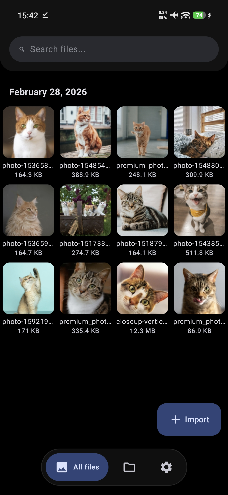
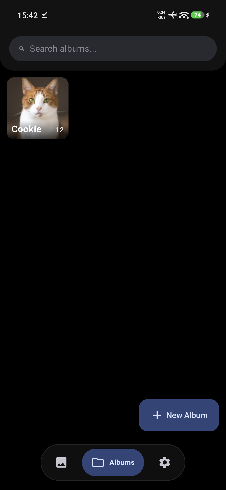
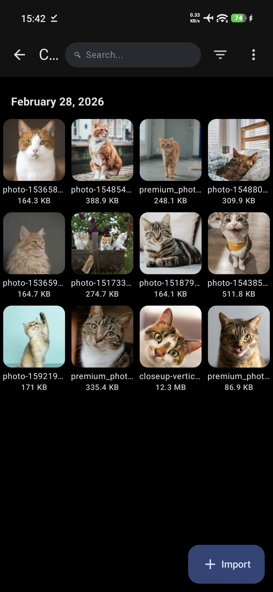
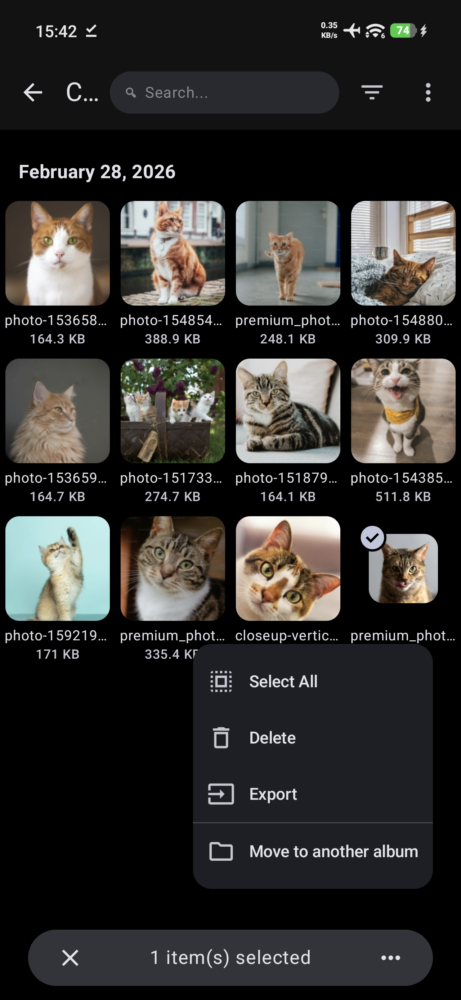

<p align="center">
  
</p>

<h1 align="center">GalleryX</h1>

<p align="center">
  <strong>A highly secure, privacy-first photo and video vault for Android.</strong>
</p>

<p align="center">
  
  
  
  
</p>

---

## 📖 About GalleryX
GalleryX is a robust Android application designed to keep your personal media truly private. Built with modern Android development practices, it encrypts your photos and videos locally, ensuring that no one can access your private moments without your permission.

Whether you need to hide sensitive documents, personal photos, or private videos, GalleryX provides bank-grade encryption paired with an intuitive, fluid user interface.

## ✨ Key Features
* **🔒 AES-256 Encryption:** Your media is fully encrypted on your local storage. No cloud leaks, no unauthorized access.
* **👻 Stealth Mode / App Hiding:** Disguise the app or hide it entirely from the launcher. Launch it via a secret dialer code.
* **👆 Biometric Unlock:** Quickly and securely access your vault using your device's fingerprint or face unlock.
* **📁 Smart Album Management:** Organize your encrypted photos and videos into custom albums.
* **☁️ Encrypted Backups:** Safely backup and restore your encrypted vault so you never lose your memories.
* **🎥 Built-in Media Player:** View your photos and stream your encrypted videos directly inside the app without decrypting them to public storage first.

## 📱 Screenshots

<p align="center">
  
  
  
  
</p>

## 🛠️ Tech Stack & Architecture
GalleryX is built using the latest Android development standards:
* **Language:** [Kotlin](https://kotlinlang.org/) (100%)
* **UI Toolkit:** Jetpack Compose & XML (Hybrid approach)
* **Architecture:** MVVM (Model-View-ViewModel)
* **Local Database:** Room Database
* **Concurrency:** Kotlin Coroutines & Flow
* **Dependency Injection:** Dagger Hilt
* **Security:** Android Keystore System, BiometricPrompt API, AES Encryption

## 🚀 Getting Started

### Prerequisites
* Android Studio (Latest Version)
* JDK 17+
* Minimum SDK: 24 (Android 7.0)

### Building the Project
1. Clone the repository:
   ```bash
   git clone [https://github.com/Midxv/GalleryX.git](https://github.com/Midxv/GalleryX.git)