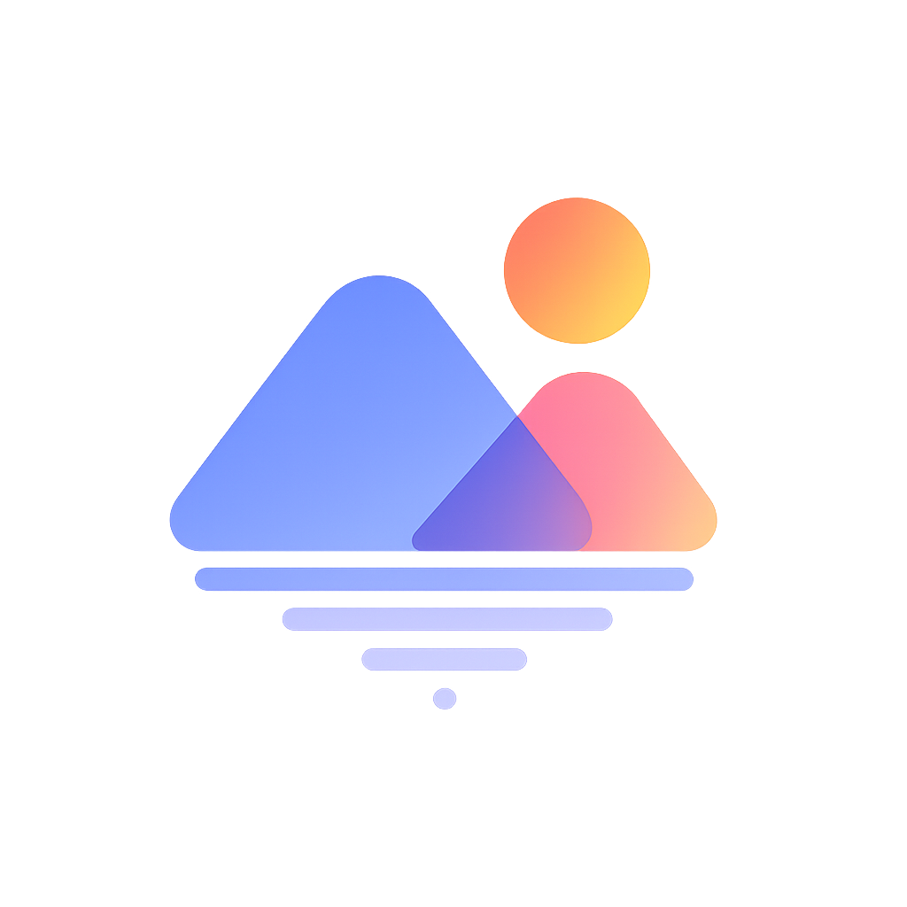
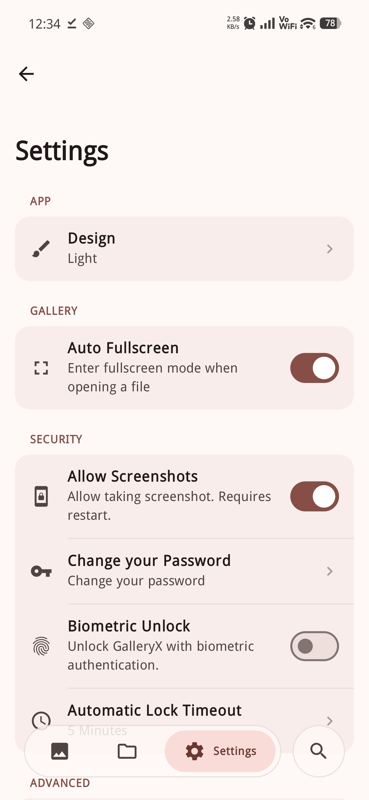
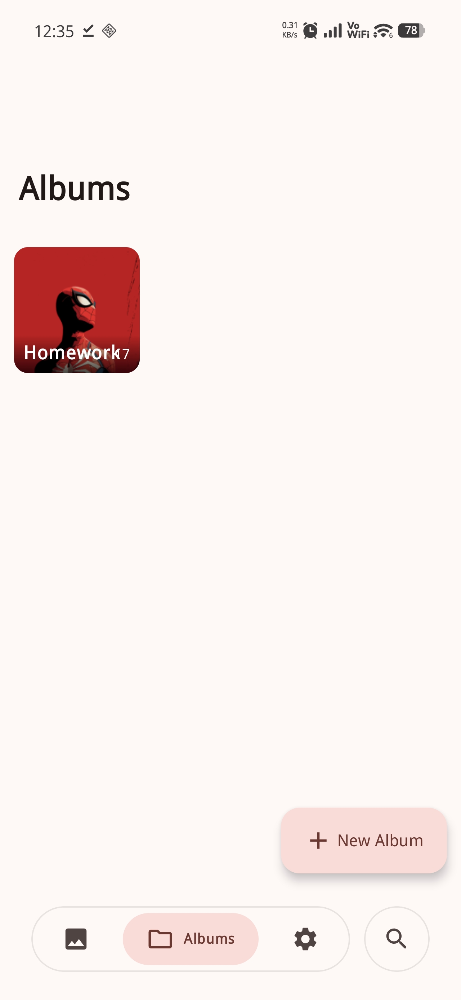
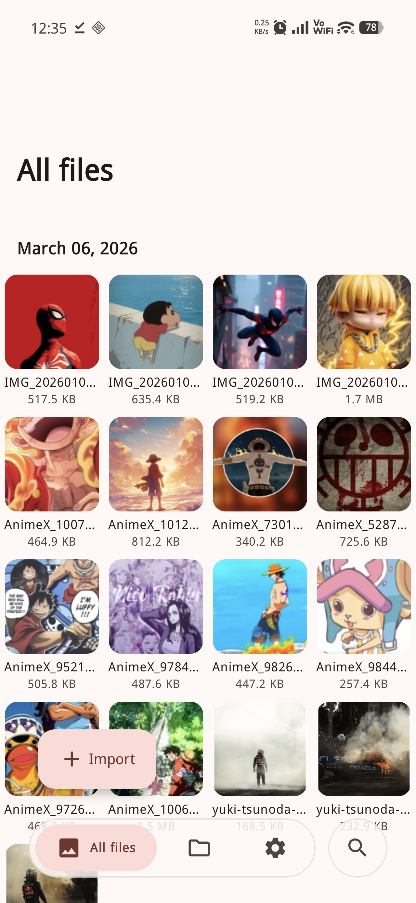
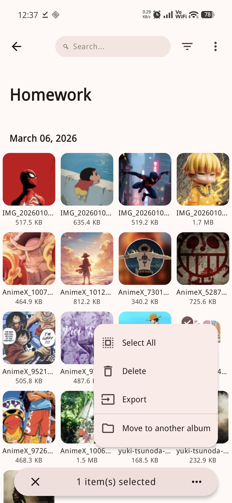

<p align="center">
  
</p>

<h1 align="center">GalleryX</h1>

<p align="center">
  Privacy-first offline media vault for Android
</p>

<p align="center">
  <a href="https://github.com/Midxv/GalleryX/releases">
    
  </a>
  <a href="https://github.com/Midxv/GalleryX/stargazers">
    
  </a>
  <a href="https://github.com/Midxv/GalleryX/blob/main/LICENSE">
    
  </a>
  
  
</p>

---

## Overview

GalleryX is a fully offline, privacy-focused media vault built for Android.  
It encrypts photos and videos locally using AES-256 encryption while providing AI-powered semantic search that runs entirely on-device.

No cloud sync.  
No external API calls.  
No telemetry collection.

All processing, indexing, encryption, and search operations remain local to the device.

---

## Screenshots

<p align="center">
  
  
  
  
  
</p>

---

## Features

### Secure Media Storage

- AES-256 encryption for all stored media
- Android Keystore integration for secure key management
- In-memory media decryption during playback
- Encrypted vault backup and restore support

### On-Device AI Search

- Natural language image search
- CLIP-based semantic understanding
- ONNX Runtime local inference
- Vector similarity matching using cosine similarity

Example queries:

- `dog playing on beach`
- `car at night`
- `documents on desk`

### Privacy & Access Control

- Fully offline architecture
- No analytics or tracking
- Optional hidden launcher mode
- Biometric authentication using Android BiometricPrompt API

---

## Tech Stack

| Component | Technology |
|---|---|
| Language | Kotlin |
| Architecture | MVVM |
| UI | Jetpack Compose + XML |
| Database | Room |
| Dependency Injection | Dagger Hilt |
| Concurrency | Kotlin Coroutines + Flow |
| AI Runtime | ONNX Runtime |
| Encryption | AES-256 |

---

## Requirements

- Android Studio (latest stable recommended)
- JDK 17+
- Android SDK 24+
- Git

---

## Setup

### Clone Repository

```bash
git clone https://github.com/Midxv/GalleryX.git
```

Open the project in Android Studio and allow Gradle sync to complete.

---

## AI Model Setup

The ONNX models are not included in the repository because of file size limitations.

You must manually add the required model files before building the project.

### Required Files

Download the following from the Hugging Face CLIP ONNX repository:

- `vision_model.onnx`
- `text_model.onnx`
- `vocab.json`

Recommended source:

https://huggingface.co/Xenova/clip-vit-base-patch32

### Placement

Place the files inside:

```text
app/src/main/assets/
```

Final structure:

```text
app/
└── src/
    └── main/
        └── assets/
            ├── vision_model.onnx
            ├── text_model.onnx
            └── vocab.json
```

---

## Build

After adding the models:

### Clean Project

```bash
./gradlew clean
```

### Build APK

```bash
./gradlew assembleDebug
```

Or directly build and run from Android Studio.

---

## License

Licensed under the MIT License.

See the [LICENSE](LICENSE) file for details.